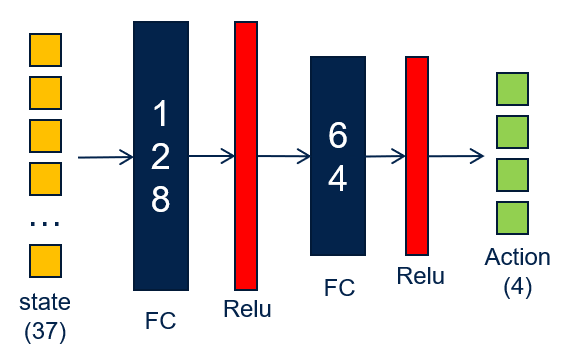

# DRL_P1_Navigation

[//]: # (Image References)

[image1]: https://user-images.githubusercontent.com/10624937/42135619-d90f2f28-7d12-11e8-8823-82b970a54d7e.gif "Trained Agent"


## 1 Introduction

The goal of this project is to train an agent to navigate and collect bananas in an Unity environment as showed in the following image:  

![Trained Agent][image1]

A reward of +1 is provided for collecting a yellow banana, and a reward of -1 is provided for collecting a blue banana. Thus, the goal of the agent is to collect as many yellow bananas as possible while avoiding blue bananas.  

The state space has 37 dimensions and contains the agent's velocity, along with ray-based perception of objects around agent's forward direction.  Given this information, the agent has to learn how to best select actions.  Four discrete actions are available, corresponding to:
- **`0`** - move forward.
- **`1`** - move backward.
- **`2`** - turn left.
- **`3`** - turn right.

The task is episodic, and in order to solve the environment, the agent must get an average score of +13 over 100 consecutive episodes.

## 2 Algorithm Implementation

### 2.1 Random Actions

Initially, I tried selecting a random action at each time step to see how much reward I could get. After running the following code several times, I found that the rewards were always below 3, which is clearly insufficient to solve the environment. Therefore, a better strategy is needed, which I will explain in the next sections.
```python
env_info = env.reset(train_mode=True)[brain_name]  # reset the environment
state = env_info.vector_observations[0]            # get the current state
score = 0                                          # initialize the score
while True:
    action = np.random.randint(action_size)        # select an action
    env_info = env.step(action)[brain_name]        # send the action to the environment
    next_state = env_info.vector_observations[0]   # get the next state
    reward = env_info.rewards[0]                   # get the reward
    done = env_info.local_done[0]                  # see if episode has finished
    score += reward                                # update the score
    state = next_state                             # roll over the state to next time step
    if done:                                       # exit loop if episode finished
        break
    
print("Score: {}".format(score))
```

### 2.2 Deep Q-Network (DQN)

Q-Learning is a reinforcement learning algorithm used to find the optimal action-selection policy for any given finite Markov decision process (MDP). It's a simple-to-implement algorithm and can be applied in a wide range of problems. However, it becomes impractical or even impossible when dealing with large or continous state and actions spaces.

As the state space is continuous in this navigation task, Deep Q-Network (DQN) becomes a better choice which is an extension of Q-Learning that uses deep neural networks to approximate the Q-values.

The neural network is implemented in the `model.py` file which can be found [here](https://github.com/yijun-deng/DRL_P1_Navigation/blob/main/model.py#L5). The following figure shows the structure of this neural network:



### 2.3 Local Network and Target Network

As showed in the `dqn_agent.py` file which can be found [here](https://github.com/yijun-deng/DRL_P1_Navigation/blob/main/dqn_agent.py#L5), the agent contains 2 instances of the Q-Network: Local network and target network.

Local network is used to select actions based on the current policy and is updated frequently using gradient descent. On the other hand, target network  is used to calculate the target Q-values for the Bellman update. It is updated less frequently, by just copying the weights from the local network every few steps.

The use of 2 instances is because that consecutive states are often highly correlated, and if the same network is used to both select and evaluate actions, these correlations can lead to unstable updates and poor learning performance.

### 2.4 Epsilon Greedy Search

Epsilon Greedy Search is used in the algorithm to balance the trade-off between exploration (trying new actions to discover their effects) and exploitation (choosing best actions based on current knowledge).

The pseudo code is as below:
```python
Initilize Epsilon
For each time step t:
    Generate a random number p between 0 and 1.
    if p > epsilon:
        Select the action a that maximize the Q value. (Exploitation)
    else:
        Select a random action a. (Exploration)
```

To make the learning more efficiency, a decayed epsilon has been used, which means that the value of epsilon is not fixed but rather decreases over time. This decay allows the agent to explore more in the early stages of training when it has less knowledge about the environment and gradually shift towards exploiting its learned knowledge as training progresses. The values of decayed epsilon are as below:
```python
eps_start=1.0, eps_end=0.01, eps_decay=0.995
```
Where eps_start is the initial value of epsilon, eps_decay is its decay rate and eps_end is its minimun value.

### 2.5 Experience Replay

When the agent interacts with the environment, the sequence of experience tuples can be highly correlated. The naive Q-learning algorithm that learns from each of these experience tuples in sequential order runs the risk of getting swayed by the effects of this correlation.

Therefore, a replay buffer containing a collection of experience tuples (S, A, R, S') is used to tackle this issue. At each iteration, a small batch of tuples from the replay buffer is sampled for the training, which can break the harmful correlations. Additionally, it also allows to learn more from individual tuples multiple times, recall rare occurrences, and in general make better use of the experience.

## 3 Result

The bolow figure shows the final result of the training. The agent was able to solve the evironment within 405 episodes with an average score of 13.05.


## 4 Future Improvements

Even though the current algorithm is good enough to solve the evironment within 405 episodes, we could still improve it to have better performance by using some tricks. Double Deep Q-Network, Dueling Deep Q-Network and Prioritized Experence Replay are 3 main methods that could be applied.

### 4.1 Double Deep Q-Network

In standard DQN, the Q-value update uses the maximum predicted Q-value for the next state, which can lead to overestimation because it tends to favor actions with higher Q-values, even if they are not the best actions.

To solve this issue, we could use Double DQN which could reduce the overestimation of action values by using two networks for action selection and evaluation, leading to better learning stability.

### 4.2 Dueling Deep Q-Network

Another improvement could be the adoption of Dueling DQN which is a new architecture where the Q-value function is decomposed into two separate streams: The value Stream which estimates the value of being in a particular state, and the advantage stream which estimates the advantage of each action in that state. The final Q-value for each action is computed by combining both.

By using the Dueling DQN, the agent could have more stable learning and faster convergence, as it reduces the variance in the Q-value estimates.

### 4.3 Prioritized Experience Replay

Experiecne replay is very important to break correlations among a sequence of experience tuples. In this project, the tuples in the replay buffer are uniformly randomly selected. However, some of the experiences could be more important than others, and moreover, these important experiences might occur infrequently, which leads to a very small chance of being selected.

To improve it, we could use a prioritized experience reply, which assigns a priority to each experience based on its importance for learning. The priority is determined by the Temporal Difference (TD) error. A higher TD error suggests that the experience is more valuable for learning.

